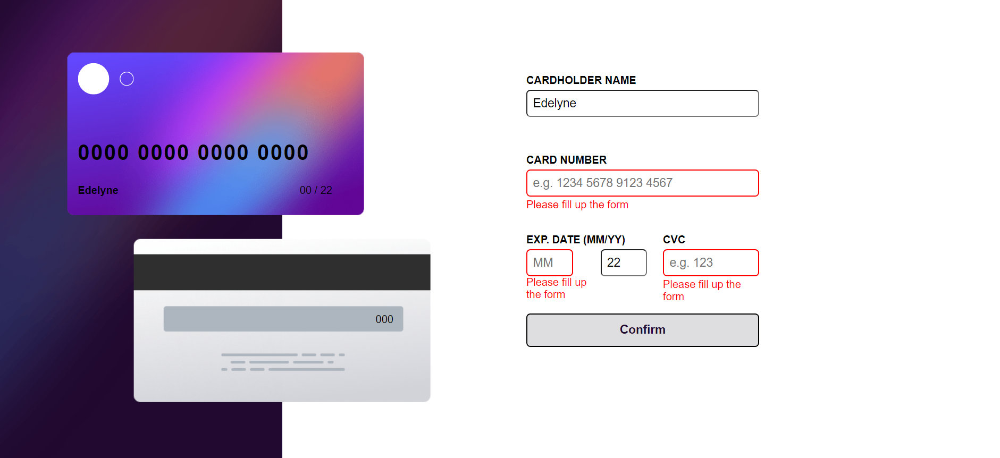
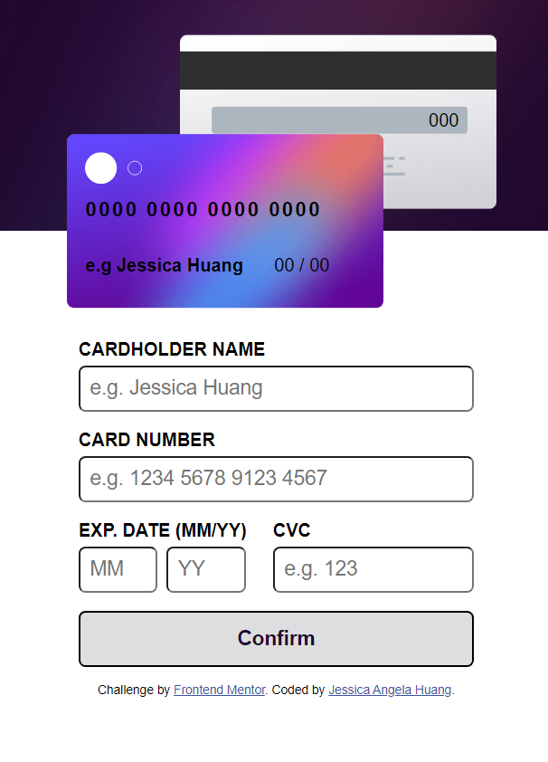

# Quiz 2 - Interactive card detail solution

This is a solution to the [Interactive card detail page Quiz 2 challenge]

## Table of contents

- [Overview](#overview)
  - [The challenge](#the-challenge)
  - [Screenshot](#screenshot)
  - [Links](#links)
- [My process](#my-process)
  - [Built with](#built-with)
  - [What I learned](#what-i-learned)
  - [Continued development](#continued-development)
  - [Useful resources](#useful-resources)
- [Author](#author)
- [Acknowledgments](#acknowledgments)


## Overview

### The challenge

Users should be able to:

- Fill in the form and see the card details update in real-time
- Receive error messages when the form is submitted if:
  - Any input field is empty
  - The card number, expiry date, or CVC fields are in the wrong format
- View the optimal layout depending on their device's screen size
- See hover, active, and focus states for interactive elements on the page

### Screenshot

> Desktop output

> Mobile output



### Links

- Solution URL: https://github.com/JessicaAngelah/interactive-card-details-form.git
- Live Site URL: [Add live site URL here](https://your-live-site-url.com)

## My process

### Built with

- Vscode
- CSS custom properties
- Flexbox
- CSS Grid
- Javascript


### What I learned


```js
function format(s) {
  return s.toString().replace(/\d{4}(?=.)/g, "$& ");
}
```


### Continued development

I want to improve in javascript because i think that im not that great at javascript.

### Useful resources

- https://www.w3schools.com/colors/colors_hsl.asp - This website helped me for finding the exact color that i want. I really like how it can find/translate color like hexadecimal colors, HSL and RGB.
- https://www.w3schools.com/ - This is an amazing website that helps me to learn topics i have not understand. It has examples which makes it easier to understand, which i think is going to be very useful especially for beginners. Not only html, it has other languages like css, javascript, python, etc. It is also free to use, unlike other website where you have to pay to use.


## Your Detail (Author)

- FullName - Jessica Angela Huang
- StudentID - 2602213031
- BINUS Email - jessica.huang@binus.ac.id

## Acknowledgments

This is where you can give a hat tip to anyone who helped you out on this project. Perhaps you worked in a team or got some inspiration from someone else's solution. This is the perfect place to give them some credit.

